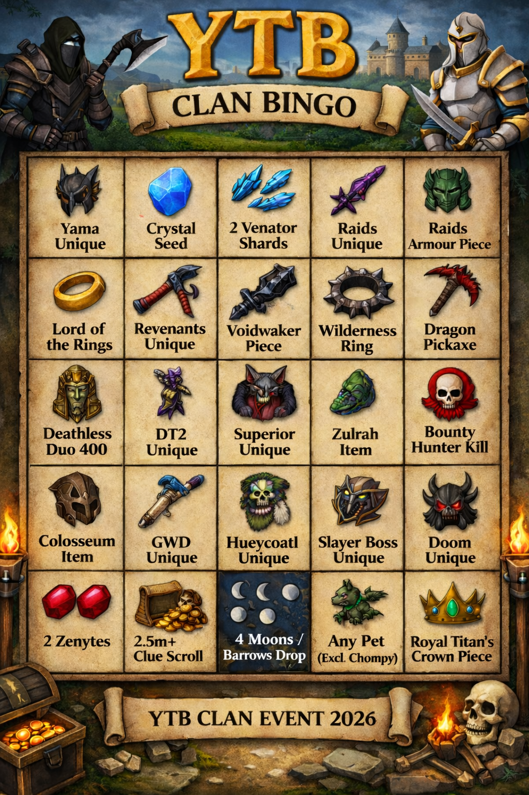

<html lang="en">
								
							<head>
  <meta charset="UTF-8">
  <meta name="viewport" content="width=device-width, initial-scale=1.0">
  <title>YTB Clan Bingo 2026</title>
  
</head>
<body>
  

    <!-- Replace src with your image filename -->
    

    

      <!-- 25 invisible clickable tiles -->
      

      

      

      

      

    

  

  

</body></html>
